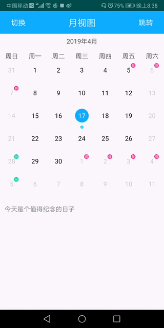

# CalendarLayout
***
这是一个轻量级的Android日历控件。拥有良好的可扩展性和美观的用户交互界面。支持月视图、周视图；支持选择日期进行跳转；支持对选定的日期进行自定义渲染。


***
## CalendarLayout特色功能
* 对指定日期进行自定义时间处理
``` java
/**
 * @param selectedDate 选中日期
 * @brief 焦点日期发生跳转执行的回调 */ void onDateSelected(Date selectedDate);
 ```
* 对日期进行自定义渲染
``` java
/**
 * @param date 当前日期
 * @brief 对于日历单元格进行渲染，区域顶部已经绘制完成日历日期 */
public void onDraw(Canvas canvas, int viewWidth, int viewHeight, Date date) {
}
```
* 支持查看未来、历史日期，置灰其他日期
 ``` java
/**
 * 时间区间 * */ public enum SelectType{
  ALL,HISTORY,FUTURE }

//调整日历显示置灰区间 calLayout.setSelectType(CalendarLayout.SelectType.ALL);
```
* 选择视图显示的第一个周期
``` 
/**
 * 设置日历第一天 * */ public void setFristWeekDay(WeekDays fristWeekDay) {
  this.mFristWeekDay = fristWeekDay; }
``` 
* 日期跳转
``` java
/**
 * @param date 选中的日期
 * @brief 弹窗选中日期 * */ void onDatePickCompleted(Date date);
```
***
## 感谢 
# **[PickView](https://github.com/brucetoo/PickView)**
